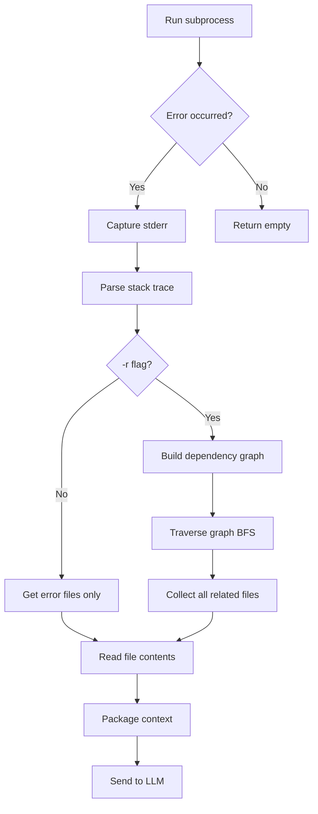

## Pipeline Overview

The error processing pipeline transforms raw subprocess failures into structured, contextualized data ready for LLM analysis.

## Stage-by-Stage Breakdown

### Stage 1: Error Capture

**Location:** `relational.py:14-20`

Splat intentionally runs failing code in a subprocess to capture stderr:

```python
try:
    subprocess.run(entrypoint, capture_output=True, check=True, text=True)
    return "", "", ""  # Return empty strings if no error occurs
except subprocess.CalledProcessError as error:
    traceback: str = error.stderr if error.stderr else str(error)
    error_information: str = str(error)
```

**Output:**
- `traceback`: Full stderr output with stack trace
- `error_information`: String representation of the error object

### Stage 2: Stack Trace Parsing

**Location:** `utils.py:47-74`

Extracts file paths from Python error traces using regex:

```python
def parse_error_stack(error_info: str) -> List[str]:
    files = []
    file_pattern = re.compile(r'(?:File "([^"]+)"|\b(\S+\.py)\b)')
    
    for line in error_info.split('\n'):
        matches = file_pattern.findall(line)
        for match in matches:
            file_path = next((m for m in match if m), None)
            if file_path and os.path.exists(file_path):
                files.append(file_path)
    
    return list(dict.fromkeys(files))  # Remove duplicates
```

**Regex Pattern Breakdown:**
- `File "([^"]+)"` - Matches standard Python traceback format
- `\b(\S+\.py)\b` - Matches standalone .py filenames

**Input example:**
```
File "/Users/user/project/app.py", line 15, in main
    result = process_data()
File "/Users/user/project/utils.py", line 8, in process_data
    raise ValueError("Invalid input")
ValueError: Invalid input
```

**Output:**
```python
['/Users/user/project/app.py', '/Users/user/project/utils.py']
```

### Stage 3: Dependency Graph Construction

**Location:** `utils.py:130-189`

When `-r` flag is used, builds an adjacency list of file dependencies:

```python
def build_adjacency_list(files: List[str], project_root: str) -> Dict[str, List[str]]:
    adjacency_list = {}
    processed_files = set()
    
    def process_file(file: str):
        if file in processed_files:
            return
            
        processed_files.add(file)
        imports = set()
        
        with open(file, 'r') as f:
            tree = ast.parse(f.read())
            for node in ast.walk(tree):
                if isinstance(node, ast.Import):
                    imports.update(alias.name for alias in node.names)
                elif isinstance(node, ast.ImportFrom) and node.module:
                    imports.add(node.module)
        
        adjacency_list[file] = []
        for imp in imports:
            # Resolve import to file path
            module_path = resolve_import_path(imp, file, project_root)
            if module_path:
                adjacency_list[file].append(module_path)
                process_file(module_path)  # Recursive
```

**Example graph structure:**
```python
{
    '/project/app.py': ['/project/utils.py', '/project/models.py'],
    '/project/utils.py': ['/project/helpers.py'],
    '/project/models.py': ['/project/database.py'],
    '/project/helpers.py': [],
    '/project/database.py': []
}
```

### Stage 4: Nth-Degree Traversal

**Location:** `utils.py:108-122`

Collects all files related to error files through graph traversal:

```python
def get_nth_related_files(start_files: List[str], graph: Dict[str, List[str]]) -> Set[str]:
    related_files = set(start_files)
    planned_visit = list(start_files)
    possible_files = set()
    
    while planned_visit:
        current = planned_visit.pop(0)  # BFS approach
        possible_files.add(current)
        
        for neighbor in graph.get(current, []):
            if neighbor not in related_files:
                related_files.add(neighbor)
                planned_visit.append(neighbor)
    
    return possible_files
```

**Algorithm:** Breadth-First Search (BFS)

**Example traversal:**
```
Start: [app.py]  (error file)
  → Visit app.py, add neighbors: [utils.py, models.py]
  → Visit utils.py, add neighbors: [helpers.py]
  → Visit models.py, add neighbors: [database.py]
  → Visit helpers.py (no neighbors)
  → Visit database.py (no neighbors)

Result: {app.py, utils.py, models.py, helpers.py, database.py}
```

### Stage 5: Context Packaging

**Location:** `utils.py:81-100`

Reads file contents and packages them for LLM consumption:

```python
def run_mock_repopack(paths: List[str], style: str = 'json') -> str:
    result = []
    for path in paths:
        if os.path.exists(path):
            with open(path, 'r') as f:
                content = f.read()
            result.append(f"File: {path}\nContent:\n{content}\n")
    
    return "\n" + "="*50 + "\n".join(result) + "="*50 + "\n"
```

**Output format:**
```
==================================================
File: /project/app.py
Content:
import utils

def main():
    utils.process()
==================================================
File: /project/utils.py
Content:
def process():
    raise ValueError("Error")
==================================================
```

## Pipeline Flow Diagram



## Import Resolution Strategy

**Location:** `utils.py:162-177`

The system tries multiple paths to resolve imports:

1. **Package imports** (e.g., `from foo.bar import baz`):
   ```python
   os.path.join(project_root, *imp.split('.')) + '.py'
   # Example: 'foo.bar' → '/project/foo/bar.py'
   ```

2. **Relative imports** (same directory):
   ```python
   os.path.join(file_dir, f"{imp}.py")
   ```

3. **Absolute imports** (from project root):
   ```python
   os.path.join(project_root, f"{imp}.py")
   ```

## Error Handling

The pipeline gracefully handles:

**1. Syntax errors in source files:**
```python
try:
    tree = ast.parse(content)
except SyntaxError:
    pass  # Skip AST parsing, file still included
```
See `utils.py:152-153`.

**2. Missing files:**
```python
if os.path.exists(file_path):
    files.append(file_path)
```
See `utils.py:71-72`.

**3. Non-project files:**
```python
def is_project_file(file_path: str, project_root: str) -> bool:
    return os.commonpath([file_path, project_root]) == project_root
```
See `utils.py:38-39`.

## Performance Considerations

### Time Complexity

| Stage | Complexity | Notes |
|-------|-----------|-------|
| Stack parsing | O(n) | n = lines in traceback |
| Graph building | O(V + E) | V = files, E = imports |
| BFS traversal | O(V + E) | Standard graph traversal |
| File reading | O(k × m) | k = files, m = avg file size |

### Space Complexity

- **Graph storage:** O(V + E)
- **File contents:** O(total file size)
- **Visited set:** O(V)

### Optimization: Deduplication

Files are tracked in sets to prevent redundant processing:
```python
processed_files = set()  # Prevents re-parsing
related_files = set(start_files)  # Prevents duplicate traversal
```

## Common Edge Cases

### Case 1: Circular Dependencies

```python
# a.py
import b

# b.py
import a
```

**Handled by:** `processed_files` set prevents infinite recursion

### Case 2: External Dependencies

```python
import numpy  # Not in project
import utils  # In project
```

**Handled by:** Path existence check filters out stdlib/site-packages

### Case 3: Dynamic Imports

```python
__import__('module_name')
importlib.import_module('foo')
```

**Limitation:** AST parsing only catches static imports. Dynamic imports are not detected.

## Next Steps

<CardGroup cols={2}>
  <Card title="LLM Integration" icon="brain" href="/advanced/architecture/llm-integration">
    Learn how parsed data feeds into LLM prompts
  </Card>
  <Card title="Architecture Overview" icon="sitemap" href="/advanced/architecture/overview">
    Return to system overview
  </Card>
</CardGroup>
