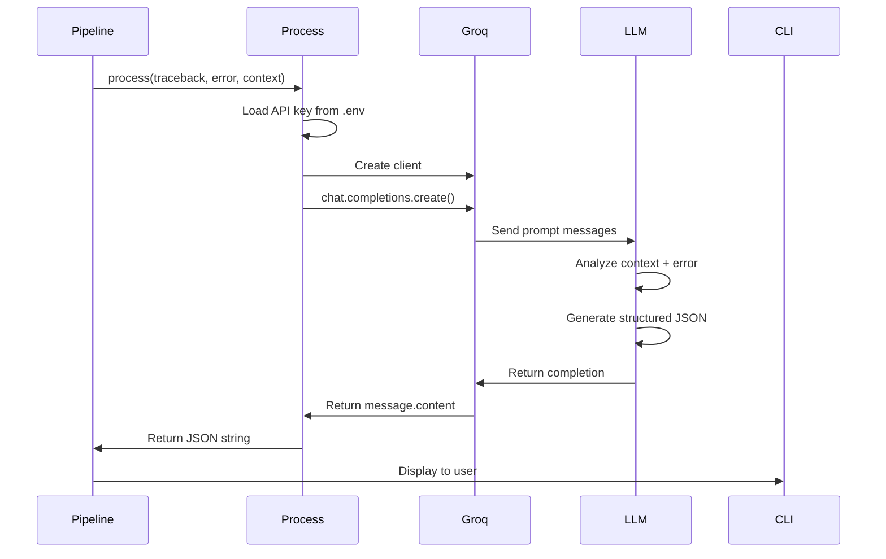

## LLM Integration Overview

Splat uses **Groq's LLM API** with the `llama3-70b-8192` model to transform error context into structured debugging advice.

## Process Function

**Location:** `process/process.py:10-39`

The core LLM integration function:

```python
def process(traceback_message: str, original_error_information: str, context: str) -> object:
    client = Groq(api_key=os.getenv("API"))
    
    chat_completion = client.chat.completions.create(
        messages=[...],  # See prompt engineering section
        model="llama3-70b-8192",
        response_format={"type": "json_object"}
    )
    
    return chat_completion.choices[0].message.content
```

**Input parameters:**
- `traceback_message`: Full stderr stack trace
- `original_error_information`: Stringified error object
- `context`: Concatenated file contents from repopack

**Output:** JSON string with structured debugging advice

## Prompt Engineering Strategy

Splat uses a **multi-message system prompt** to guide LLM behavior through progressive instruction layering.

### Message 1: Role Definition

```python
{
    "role": "system",
    "content": "You are an expert software debugging assistant specializing in Python error analysis. Your task is to analyze error tracebacks and provide structured, actionable advice. Follow these steps precisely:"
}
```

**Purpose:** Establishes expertise domain and sets expectations

### Message 2: Step-by-Step Instructions

```python
{
    "role": "system",
    "content": """1. Analyze the provided error traceback and original error message.
2. Identify the source of the error within the repository structure.
3. Explain the error concisely in natural language.
4. Provide specific, actionable suggestions for resolving the error.
5. Format your response as a JSON object with the exact structure specified below."""
}
```

**Purpose:** Guides reasoning process step-by-step

### Message 3: Schema Definition

```python
{
    "role": "system",
    "content": """Your response MUST be a valid JSON object with this exact structure:
{
  "where": {
    "repository_path": "<absolute path to repository>",
    "file_name": "<name of file containing error>",
    "line_number": "<line number where error occurred>"
  },
  "what": {
    "error_type": "<specific Python error type>",
    "description": "<concise explanation of error>"
  },
  "how": {
    "error_origination": "<line number where error originated>",
    "suggested_code_solution": "<code snippet to fix the error>"
  }
}"""
}
```

**Purpose:** Enforces structured output format

### Message 4: Constraints & Edge Cases

```python
{
    "role": "system",
    "content": """Constraints:
- Provide ONLY the JSON object as your response. Do not include any other text.
- Ensure all JSON keys are exactly as specified.
- The 'suggested_code_solution' should be a valid Python code snippet without explanation.
- If multiple errors exist, focus on the most critical one that likely caused the others.
- Do not use placeholders in your response. Provide specific, contextual information based on the given error.
- Only fix the line from the line number given that is causing the error."""
}
```

**Purpose:** Prevents common failure modes

### Message 5: User Context

```python
{
    "role": "user",
    "content": f"Context: {context}\n\nTraceback message: {traceback_message}\n\nOriginal error message: {original_error_information}"
}
```

**Purpose:** Provides actual debugging data

## Structured Output Enforcement

Splat uses Groq's **JSON mode** to guarantee valid JSON responses:

```python
response_format={"type": "json_object"}
```

This ensures the LLM output is always parseable without additional validation.

## Response Schema

### Expected JSON Structure

```json
{
  "where": {
    "repository_path": "/Users/user/project",
    "file_name": "app.py",
    "line_number": "15"
  },
  "what": {
    "error_type": "ValueError",
    "description": "The function expected a positive integer but received a negative value"
  },
  "how": {
    "error_origination": "15",
    "suggested_code_solution": "if value < 0:\n    raise ValueError('Value must be positive')\nresult = process(value)"
  }
}
```

### Schema Breakdown

| Field | Type | Purpose |
|-------|------|----------|
| `where.repository_path` | string | Absolute path to project root |
| `where.file_name` | string | File containing the error |
| `where.line_number` | string | Line where error occurred |
| `what.error_type` | string | Python exception class name |
| `what.description` | string | Human-readable error explanation |
| `how.error_origination` | string | Line where error originated |
| `how.suggested_code_solution` | string | Code snippet to fix the issue |

## Model Configuration

### Groq API Settings

```python
client = Groq(api_key=os.getenv("API"))

chat_completion = client.chat.completions.create(
    messages=[...],
    model="llama3-70b-8192",  # 70B parameter model with 8K context
    response_format={"type": "json_object"}
)
```

### Model Choice: llama3-70b-8192

**Characteristics:**
- **Size:** 70 billion parameters
- **Context window:** 8,192 tokens
- **Strengths:** Code understanding, structured output
- **Speed:** Fast inference via Groq's LPU architecture

**Why this model?**
- Large enough for complex code analysis
- Fast enough for real-time debugging
- Strong JSON adherence

## Context Window Management

With an 8K token limit, context must be carefully managed:

### Token Budget Breakdown

| Component | Approx. Tokens | % of Budget |
|-----------|----------------|-------------|
| System prompts | ~500 | 6% |
| Traceback | ~200-500 | 3-6% |
| File context | ~6000-7000 | 75-87% |
| Response | ~300 | 4% |

### Context Optimization Strategies

**1. Flag-based control:**
- No flag: Only error files (minimal context)
- `-r` flag: All related files (maximum context)

**2. Smart file filtering:**
```python
if os.path.exists(path):  # Only real files
    if is_project_file(path, project_root):  # Only project files
        result.append(read_file(path))
```

**3. Deduplication:**
```python
return list(dict.fromkeys(files))  # Remove duplicate file paths
```

## Agent Architecture (Next Generation)

**Location:** `agents/agents.py`

Splat is evolving toward an agent-based architecture using **Pydantic AI**:

```python
from pydantic import BaseModel, Field
from pydantic_ai import Agent

class ZapperResult(BaseModel):
    path: str = Field("The path to the file where the error occurs")
    file: str = Field("The name of the file with the error")
    line: int = Field("Which line the error occured in", ge=0)
    what: str = Field("Explanation in natural language of what the error is")
    todo: str = Field("Describe steps to take in natural language in order to fix the error")

bug_zapper = Agent(
    model_name=os.getenv('MODEL'),
    api_key=os.getenv('API_KEY'),
    deps_type=FlagDependencies,
    result_type=ZapperResult,
    system_prompt=(
        'You are an expert software debugging assistant specializing in programming error analysis. '
        'Your task is to analyze error tracebacks and provide structured, actionable advice. '
    )
)
```

### Key Differences from Current Implementation

| Feature | Current (`process.py`) | Next Gen (`agents.py`) |
|---------|------------------------|------------------------|
| **Framework** | Raw Groq API | Pydantic AI |
| **Schema validation** | Manual JSON parsing | Automatic Pydantic validation |
| **Type safety** | Runtime checks | Compile-time types |
| **Dependency injection** | Global context | `FlagDependencies` dataclass |
| **Tool support** | None | `@agent.tool` decorators |

### Pydantic AI Benefits

**1. Automatic validation:**
```python
line: int = Field("Which line the error occured in", ge=0)
# Ensures line number is non-negative integer
```

**2. Type safety:**
```python
result: ZapperResult = await bug_zapper.run(context)
print(result.path)  # IDE autocomplete works
```

**3. Dependency injection:**
```python
@dataclass
class FlagDependencies:
    flag: str
    file_path: Union[str, Path]
```

Enables passing user flags and file paths into the agent context.

## Prompt Engineering Best Practices

### 1. Progressive Instruction Layering

Break complex instructions into multiple messages:
- Message 1: Role
- Message 2: Process
- Message 3: Schema
- Message 4: Constraints

**Why?** LLMs process sequential messages more reliably than one dense prompt.

### 2. Explicit Format Enforcement

```python
response_format={"type": "json_object"}
```

**Why?** Prevents LLMs from adding markdown fences or explanatory text.

### 3. Negative Constraints

```
- Do not use placeholders
- Do not include any other text
- Only fix the line from the line number given
```

**Why?** LLMs often add unwanted extras. Explicit negatives prevent this.

### 4. Contextual Specificity

```
Provide specific, contextual information based on the given error.
```

**Why?** Prevents generic "check your code" advice.

### 5. Single-Error Focus

```
If multiple errors exist, focus on the most critical one that likely caused the others.
```

**Why?** Cascading errors often have a root cause. Fixing the root fixes downstream issues.

## Error Handling & Edge Cases

### API Failures

**Current implementation:** No explicit error handling

**Recommended addition:**
```python
try:
    chat_completion = client.chat.completions.create(...)
except Exception as e:
    return {"error": str(e)}
```

### Invalid JSON Responses

**Mitigation:** JSON mode enforces valid JSON

**Fallback:** Parse errors should still be caught:
```python
import json
try:
    result = json.loads(response)
except json.JSONDecodeError:
    # Handle malformed response
```

### Token Limit Exceeded

**Current behavior:** API will truncate or error

**Recommendation:** Pre-check token count:
```python
import tiktoken
encoding = tiktoken.encoding_for_model("llama3")
if len(encoding.encode(context)) > 7000:
    # Truncate or summarize context
```

## Performance Metrics

### Typical Response Times

| Context Size | Approx. Time |
|--------------|-------------|
| < 2K tokens | ~1-2 seconds |
| 2K-5K tokens | ~2-4 seconds |
| 5K-8K tokens | ~4-6 seconds |

**Note:** Groq's LPU architecture provides significantly faster inference than traditional GPU-based services.

### Cost Considerations

Groq pricing (as of 2024):
- Input: $0.10 per 1M tokens
- Output: $0.10 per 1M tokens

**Typical Splat request:**
- Input: ~7K tokens = $0.0007
- Output: ~300 tokens = $0.00003
- **Total per debug:** ~$0.0007 (less than a penny)

## Integration Flow Diagram



## Environment Configuration

**Required:** `.env` file with API key

```bash
API=gsk_your_groq_api_key_here
```

Loaded via:
```python
from dotenv import load_dotenv
load_dotenv()

client = Groq(api_key=os.getenv("API"))
```

See `process/process.py:5-8`.

## Next Steps

<CardGroup cols={2}>
  <Card title="Error Pipeline" icon="diagram-project" href="/advanced/architecture/error-pipeline">
    Learn how context is prepared for LLM
  </Card>
  <Card title="Architecture Overview" icon="sitemap" href="/advanced/architecture/overview">
    Return to system overview
  </Card>
</CardGroup>
