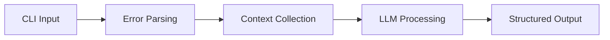
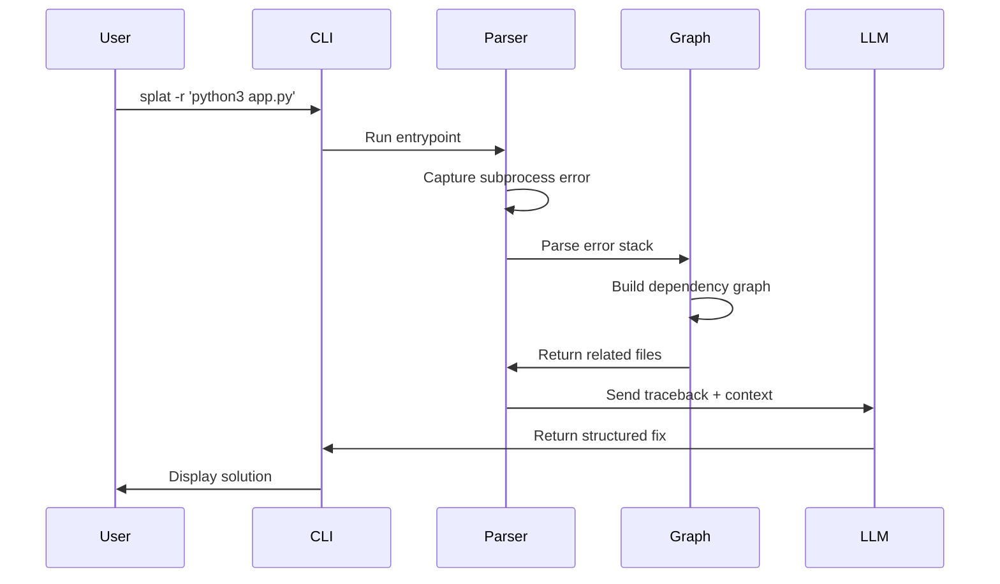

## Architecture Overview

Splat is built as a **three-stage pipeline** that transforms Python errors into actionable debugging insights using LLM-powered analysis.

## Pipeline Stages



### Stage 1: CLI Entry Point

The main entry point (`module.py:13-31`) orchestrates the entire pipeline:

```python
def main():
    entrypoint: List[str] = ['python3', 'foo.py']
    flag: str = "-r"
    traceback, error_info, repopack = relational_error_parsing_function(entrypoint, flag)
    response: object = process(traceback, error_info, repopack)
```

**Key responsibilities:**
- Accept user command with optional flags (`-r` for relational analysis)
- Coordinate between error parsing and LLM processing
- Return structured results to CLI

### Stage 2: Error Parsing & Context Collection

The relational parsing layer (`relational.py:13-30`) handles error capture and context gathering:

```python
def relational_error_parsing_function(entrypoint, flag: str = "") -> Tuple[str, str, str]:
    try:
        subprocess.run(entrypoint, capture_output=True, check=True, text=True)
    except subprocess.CalledProcessError as error:
        traceback: str = error.stderr
        collected_traceback_files = parse_error_stack(traceback)
        
        if flag == '-r':
            graph = build_adjacency_list(collected_traceback_files, project_root)
            all_related_files = get_nth_related_files(collected_traceback_files, graph)
            return traceback, error_information, run_mock_repopack(list(all_related_files))
```

**Returns three critical pieces:**
1. **Traceback**: Raw error stack trace
2. **Error info**: Structured error details
3. **Repopack**: Contextual file contents

### Stage 3: LLM Analysis

The process layer (`process/process.py:10-39`) transforms error data into actionable fixes using Groq's LLM API.

## Data Flow Diagram



## Flag Behavior

Splat supports different levels of context gathering:

### No Flag (Basic Mode)
```bash
splat 'python3 app.py'
```
Scans **only files in error stack trace**.

### `-r` Flag (Relational Mode)
```bash
splat -r 'python3 app.py'
```
Scans **error files + all Nth-degree import relationships**.

This builds a full dependency graph using AST parsing to find all related modules.

## Component Interaction

| Component | File | Responsibility |
|-----------|------|----------------|
| **Pipeline Orchestrator** | `module.py` | Coordinates stages |
| **Error Parser** | `relational.py` | Captures runtime errors |
| **Stack Parser** | `utils.py:47-74` | Extracts file paths from traces |
| **Graph Builder** | `utils.py:130-189` | Creates dependency adjacency list |
| **Context Collector** | `utils.py:81-100` | Reads file contents |
| **LLM Processor** | `process/process.py` | Generates solutions |

## Key Design Patterns

### 1. Intentional Error Catching

Splat **deliberately runs failing code** to capture errors:

```python
try:
    subprocess.run(entrypoint, capture_output=True, check=True, text=True)
except subprocess.CalledProcessError as error:  # This will always run, on purpose
    traceback: str = error.stderr
```

See `relational.py:14-19`.

### 2. Graph-Based Context Collection

The `-r` flag triggers recursive dependency resolution:

```python
graph = build_adjacency_list(collected_traceback_files, project_root)
all_related_files = get_nth_related_files(collected_traceback_files, graph)
```

This ensures the LLM receives **complete context** about import relationships.

### 3. AST-Powered Import Detection

The system uses Python's `ast` module to parse imports without executing code:

```python
tree = ast.parse(content)
for node in ast.walk(tree):
    if isinstance(node, ast.Import):
        imports.update(alias.name for alias in node.names)
    elif isinstance(node, ast.ImportFrom) and node.module:
        imports.add(node.module)
```

See `utils.py:146-151`.

## Performance Characteristics

**Basic Mode (`-r` not used):**
- Minimal file reading
- Fast execution
- Limited context

**Relational Mode (`-r` flag):**
- Full dependency traversal
- Higher token usage
- Comprehensive context
- Better LLM accuracy

## Next Steps

<CardGroup cols={2}>
  <Card title="Error Pipeline" icon="diagram-project" href="/advanced/architecture/error-pipeline">
    Deep dive into error parsing stages
  </Card>
  <Card title="LLM Integration" icon="brain" href="/advanced/architecture/llm-integration">
    Learn about prompt engineering
  </Card>
</CardGroup>
