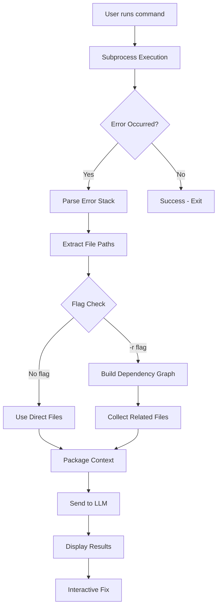

## Overview

Splat is an AI-powered debugging CLI tool that automatically analyzes runtime errors, builds context from your codebase, and provides intelligent fixes. The system combines error parsing, dependency analysis, and LLM-powered code understanding to deliver actionable debugging insights.

## Architecture

Splat's architecture consists of three core components working together:

<Steps>
  <Step title="Error Capture & Parsing">
    Intercepts runtime errors and extracts file paths, line numbers, and stack traces
  </Step>
  <Step title="Context Collection">
    Builds a dependency graph and gathers relevant source code context
  </Step>
  <Step title="AI Analysis">
    Sends context to LLM for structured error analysis and solution generation
  </Step>
</Steps>

## Workflow Diagram



## Core Pipeline

### 1. Command Execution

Splat wraps your application's entrypoint using subprocess execution:

```python relational.py
def relational_error_parsing_function(entrypoint, flag: str = "") -> Tuple[str, str, str]:
  try:
    subprocess.run(entrypoint, capture_output=True, check=True, text=True)
    return "", "", ""  # Return empty strings if no error occurs
  except subprocess.CalledProcessError as error:
    # Capture the error output to simulate the error stack
    traceback: str = error.stderr if error.stderr else str(error)
    error_information: str = str(error)
    collected_traceback_files = parse_error_stack(traceback)
```

<Info>
  The `capture_output=True` flag ensures both stdout and stderr are captured for analysis.
</Info>

### 2. Error Stack Parsing

When an error occurs, Splat extracts all file paths mentioned in the traceback:

```python utils/utils.py
def parse_error_stack(error_info: str) -> List[str]:
  files = []
  # This regex looks for file paths in various formats
  file_pattern = re.compile(r'(?:File "([^"]+)"|\b(\S+\.py)\b)')

  for line in error_info.split('\n'):
    matches = file_pattern.findall(line)
    for match in matches:
      file_path = next((m for m in match if m), None)
      if file_path:
        file_path = file_path.strip().strip('\'\'"')
        if os.path.exists(file_path):
          files.append(file_path)

  return list(dict.fromkeys(files))
```

<Tip>
  The regex pattern handles both quoted paths (`File "path.py"`) and unquoted paths (`path.py`) commonly found in error tracebacks.
</Tip>

### 3. Context Packaging

Depending on the flag provided, Splat collects different levels of context:

<CodeGroup>
```python Basic Mode (No Flag)
# Only files directly mentioned in error stack
return traceback, error_information, run_mock_repopack(collected_traceback_files)
```

```python Relational Mode (-r flag)
# Files + all their dependencies
graph = build_adjacency_list(collected_traceback_files, project_root)
all_related_files = get_nth_related_files(collected_traceback_files, graph)
return traceback, error_information, run_mock_repopack(list(all_related_files))
```
</CodeGroup>

### 4. LLM Processing

The collected context is sent to an LLM with structured prompts:

```python process/process.py
def process(traceback_message: str, original_error_information: str, context: str) -> object:
  client = Groq(api_key=os.getenv("API"))

  chat_completion = client.chat.completions.create(
    messages=[
      {
        "role": "system",
        "content": "You are an expert software debugging assistant..."
      },
      {
        "role": "user",
        "content": f"Context: {context}\n\nTraceback: {traceback_message}"
      }
    ],
    model="llama3-70b-8192",
    response_format={"type": "json_object"}
  )
  return chat_completion.choices[0].message.content
```

<Note>
  Splat uses structured JSON output to ensure consistent, parseable responses from the LLM.
</Note>

## Response Structure

The LLM returns a structured JSON response with three key sections:

```json
{
  "where": {
    "repository_path": "/absolute/path/to/repo",
    "file_name": "error_file.py",
    "line_number": "42"
  },
  "what": {
    "error_type": "SyntaxError",
    "description": "Unclosed parenthesis in print statement"
  },
  "how": {
    "error_origination": "42",
    "suggested_code_solution": "print(hello)"
  }
}
```

## Interactive Terminal Display

Results are displayed using an interactive prompt:

```python terminalout/terminal.py
def terminalstep1(json_object):
    data = json.loads(json_object)
    print_formatted_text(HTML("🔎 <u><b>Details about error</b></u>"))
    print_formatted_text(HTML(f"✅ Error at line {data['where']['line_number']}"))
    print_formatted_text(HTML(f"✅ File: {data['where']['file_name']}"))
    print_formatted_text(HTML(f"✅ Type: {data['what']['error_type']}"))
```

<Tip>
  Users can navigate with arrow keys to accept or reject the suggested fix.
</Tip>

## Key Design Decisions

<AccordionGroup>
  <Accordion title="Why subprocess execution?">
    Running commands via subprocess allows Splat to intercept stderr/stdout without modifying the target application's code.
  </Accordion>

  <Accordion title="Why build a dependency graph?">
    Errors often stem from imported modules. The graph ensures the LLM sees all relevant context, not just the file where the error surfaced.
  </Accordion>

  <Accordion title="Why structured JSON responses?">
    JSON output from the LLM enables programmatic parsing and consistent UI rendering, unlike free-form text responses.
  </Accordion>
</AccordionGroup>

## Next Steps

<CardGroup cols={2}>
  <Card title="Error Analysis" icon="magnifying-glass" href="/concepts/error-analysis">
    Deep dive into how Splat parses and understands errors
  </Card>
  <Card title="Dependency Graphs" icon="diagram-project" href="/concepts/dependency-graph">
    Learn how Splat maps your codebase relationships
  </Card>
</CardGroup>